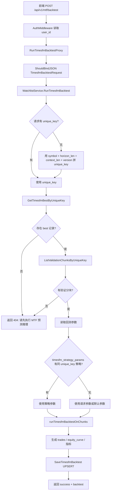

# Fintrack API 回测实现逻辑

## 结论

Fintrack API 的 MTF 回测当前由 Go 后端本地完成，不再调用 Python 回测逻辑。前端调用 `/api/v1/mtf/backtest` 后，后端读取 MTF best 记录与验证分块，按 best quantile 的预测涨跌生成交易、资金曲线和指标，并将结果 UPSERT 到 `timesfm_backtests`。

## API 调用图



## 核心回测算法图

```mermaid
flowchart TD
    A[开始: cash=initial_cash, shares=0] --> B[按 chunk_index 遍历验证分块]
    B --> C{chunk actual 有效?}
    C -- 否 --> B
    C -- 是 --> D[取 startPrice = actual[0]]

    D --> E[取 best_prediction_item 对应预测序列]
    E --> F{预测序列有效?}
    F -- 否 --> B
    F -- 是 --> G[计算 predictedPctChange = 预测末值 / 起始价 - 1]

    G --> H[计算当前持仓比例]
    H --> I{触发止盈?}
    I -- 是 --> J[按 take_profit_sell_frac 卖出]
    I -- 否 --> K[进入仓位控制]
    J --> K

    K --> L{enable_rebalance?}
    L -- 是 --> M[根据预测涨跌计算目标仓位]
    M --> N{目标仓位与当前仓位差超过容忍度?}
    N -- 是 --> O[买入或卖出到目标仓位]
    N -- 否 --> R[不交易]

    L -- 否 --> P{预测涨跌 >= 买入阈值?}
    P -- 是 --> Q[全现金买入]
    P -- 否 --> V{预测涨跌 <= 卖出阈值?}
    V -- 是 --> W[清仓卖出]
    V -- 否 --> R

    O --> X[记录 trade]
    Q --> X
    W --> X
    R --> Y[取 chunk 最后有效实际价 endPrice]
    X --> Y

    Y --> Z[计算 pvEnd = cash + shares * endPrice]
    Z --> AA[追加 equity_curve_values / pct / dates / actual_end_prices]
    AA --> B

    B --> AB[遍历结束]
    AB --> AC[计算收益率、年化、benchmark、手续费、统计]
    AC --> AD[构造 SaveTimesfmBacktestRequest 和 response]
```

## 主要代码入口

- 路由：`fintrack-api/routes/routes.go`
- Handler：`fintrack-api/handlers/watchlist_handler.go`
- 回测主入口：`fintrack-api/services/backtest_service.go`
- 回测结果保存与查询：`fintrack-api/services/watchlist_service.go`
- 请求与保存模型：`fintrack-api/models/stock.go`
- 表结构：`fintrack-api/database/schema.sql` 与 `fintrack-api/database/schema_safe.sql`

## 关键数据流

1. 前端调用 `POST /api/v1/mtf/backtest`，请求体可传 `unique_key`，也可传 `symbol/context_len/horizon_len/timesfm_version` 让后端拼 key。
2. `RunTimesfmBacktestProxy` 从登录 token 中读取 `user_id` 并写入请求。
3. `RunTimesfmBacktest` 查询 `timesfm_best_predictions`，拿到 best quantile、symbol、版本、context、horizon、cov 信息。
4. 后端查询 `timesfm_best_validation_chunks`，按 `chunk_index ASC` 获取验证分块。
5. 如果 `timesfm_strategy_params` 中存在同 `unique_key` 的策略参数，则优先使用策略参数；否则使用请求参数或默认参数。
6. `runTimesfmBacktestOnChunks` 遍历验证分块，基于 best quantile 的预测末值计算预测涨跌幅。
7. 回测逻辑根据买入阈值、卖出阈值、再平衡参数、止盈参数、手续费生成交易。
8. 每个 chunk 结束时用真实结束价计算组合资金值，并追加到资金曲线。
9. 回测完成后生成收益率、年化收益、benchmark、手续费、预测统计、交易列表。
10. `SaveTimesfmBacktest` 将结果写入 `timesfm_backtests`，冲突键为 `unique_key`。

## 默认策略参数

当请求没有覆盖参数，且数据库没有同 `unique_key` 策略时，后端使用以下默认值：

| 参数 | 默认值 | 含义 |
| --- | ---: | --- |
| `buy_threshold_pct` | `3.0` | 预测涨幅达到该值后触发买入或提高目标仓位 |
| `sell_threshold_pct` | `-1.0` | 预测跌幅达到该值后触发卖出或降到空仓 |
| `initial_cash` | `100000.0` | 初始资金 |
| `enable_rebalance` | `true` | 是否启用目标仓位再平衡 |
| `max_position_pct` | `1.0` | 最大仓位 |
| `min_position_pct` | `0.2` | 触发买入后的最低目标仓位 |
| `slope_position_per_pct` | `0.1` | 预测越强时目标仓位增加斜率 |
| `rebalance_tolerance_pct` | `0.05` | 目标仓位差超过该值才交易 |
| `trade_fee_rate` | `0.006` | 交易费率 |
| `take_profit_threshold_pct` | `10.0` | 组合累计收益达到该值后触发止盈 |
| `take_profit_sell_frac` | `0.5` | 止盈时卖出持仓比例 |

## 结果字段

`timesfm_backtests` 中保存的核心字段包括：

- `unique_key`：回测对应的 MTF best key。
- `symbol/timesfm_version/context_len/horizon_len`：模型配置。
- `covariate_config/covariate_signature/covariate_analysis`：Pro/cov 相关信息。
- `used_quantile`：实际用于回测的 best quantile。
- `buy_threshold_pct/sell_threshold_pct/trade_fee_rate/total_fees_paid`：交易规则和成本。
- `actual_total_return_pct`：验证期真实价格首尾收益。
- `benchmark_return_pct/benchmark_annualized_return_pct`：买入持有基准收益。
- `validation_start_date/validation_end_date/validation_period_days`：验证区间。
- `position_control`：仓位控制参数快照。
- `predicted_change_stats`：预测涨跌统计。
- `per_chunk_signals`：最多前 50 个分块信号摘要。
- `equity_curve_values`：资金曲线原始资金值。
- `equity_curve_pct`：扣费后的资金收益率曲线。
- `equity_curve_pct_gross`：费用还原后的收益率曲线。
- `curve_dates`：资金曲线日期。
- `actual_end_prices`：每个 chunk 的真实结束价格。
- `trades`：买入、卖出交易点。

## 已知风险与注意点

1. 如果前端不传 `unique_key`，后端拼出的 key 是 `{symbol}_best_hlen_{h}_clen_{c}_v_{version}`，不会自动追加 `_cov`。Pro/cov 回测必须显式传完整 cov `unique_key`。
2. 策略参数读取当前按同一个 `unique_key` 查询 `timesfm_strategy_params`。如果策略 key 和 MTF best key 不是同一套命名，策略不会生效，会退回请求参数或默认参数。
3. `GET /api/v1/mtf/backtest/by-unique` 目前只做登录校验，没有基于 `user_id` 或公开权限过滤。如果知道 `unique_key`，可能查询到非本人回测结果，需要根据权限模型决定是否收紧。
4. 回测按 chunk 级别交易：交易价取每个验证分块的 `actual[0]`，资金曲线点取每个分块最后有效实际价，不是日内逐日撮合。
5. `per_chunk_signals` 只保留前 50 个分块信号摘要，完整资金曲线和交易列表仍保存。

